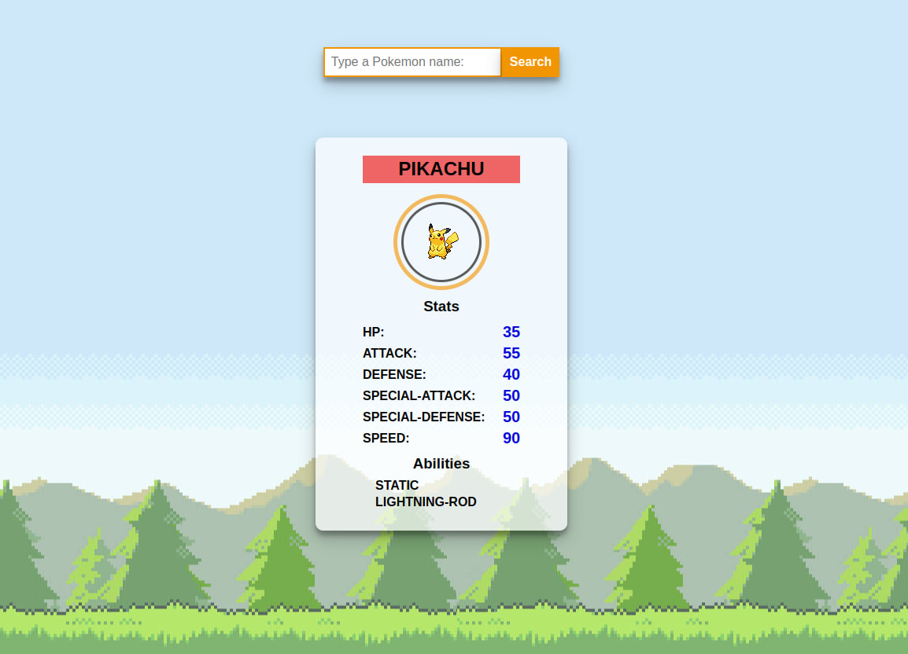

### Exercise at DCI - Web Development course

This is for educational purposes only. All credit for the design is given to the original designer.

:fast_forward: **[Live demo](https://akiko-luka.github.io/pokemon-api/)**

### Overview
Developed using vanilla JavaScript, this code utilizes fetch to retrieve Pokémon data from the PokeAPI. Upon form submission, it dynamically creates and presents a card with the Pokémon's name, image, stats, and abilities.

### Tools used
- Vanilla JS
- HTML
- CSS
- Git
- Github
- VSCode

## Screenshot

